Gym Members EDA
================
Bartosz Tasak
2024-11-18

## Wprowadznie

Dane pochodzą ze strony
[https://www.kaggle.com/datasets/valakhorasani/gym-members-exercise-dataset.](https://www.kaggle.com/datasets/valakhorasani/gym-members-exercise-dataset)
Zostały pobrane w formacie .csv

Ten zbiór danych zawiera szczegółowe informacje o ćwiczeniach
wykonywanych przez osoby korzystające z siłowni, ich cechach fizycznych
oraz poziomie sprawności. Obejmuje 973 próbki, które zawierają takie
dane, jak tętno, liczba spalonych kalorii i czas trwania treningu.
Dodatkowo, dla każdej osoby uwzględniono dane demograficzne oraz poziom
doświadczenia. Dzięki temu możliwa jest wszechstronna analiza trendów
treningowych.

### Pakiety, których będę używał

``` r
library(readr)
library(visdat)
library(ggplot2)
library(dplyr)
library(mice)
library(corrplot)
```

### Dane

``` r
dane <- read_csv("gym_members_exercise_tracking.csv")
```

### Zmienne

`Age`: Wiek osoby ćwiczącej na siłowni.

`Gender`: Płeć osoby ćwiczącej na siłowni (mężczyzna lub kobieta).

`Weight (kg)`: Waga osoby ćwiczącej w kilogramach.

`Height (m):` Wzrost osoby ćwiczącej w metrach.

`Max_BPM:` Maksymalne tętno (uderzenia na minutę) podczas sesji
treningowych.

`Avg_BPM:` Średnie tętno podczas sesji treningowych.

`Resting_BPM`: Tętno w spoczynku przed treningiem.

`Session_Duration (hours):` Czas trwania każdej sesji treningowej w
godzinach.

`Calories_Burned:` Całkowita liczba spalonych kalorii podczas każdej
sesji.

`Workout_Type:` Rodzaj wykonywanego treningu (np. Cardio, Strength,
Yoga, HIIT).

`Fat_Percentage:` Procent tkanki tłuszczowej osoby ćwiczącej.

`Water_Intake (liters)`: Dzienne spożycie wody podczas treningów.

`Workout_Frequency (days/week):` Liczba sesji treningowych w tygodniu.

`Experience_Level:` Poziom doświadczenia, od początkującego (1) do
eksperta (3).

`BMI:` Wskaźnik masy ciała, obliczany na podstawie wzrostu i wagi.
(kg/m2)

## Przyjrzyjmy się danym

### Sprawdzenie początkowych wartości w zbiorze

``` r
print(head(dane), width = Inf)
```

    ## # A tibble: 6 × 15
    ##     Age Gender `Weight (kg)` `Height (m)` Max_BPM Avg_BPM Resting_BPM
    ##   <dbl> <chr>          <dbl>        <dbl>   <dbl>   <dbl>       <dbl>
    ## 1    56 Male            88.3         1.71     180     157          60
    ## 2    46 Female          74.9         1.53     179     151          66
    ## 3    32 Female          68.1         1.66     167     122          54
    ## 4    25 Male            53.2         1.7      190     164          56
    ## 5    38 Male            46.1         1.79     188     158          68
    ## 6    56 Female          58           1.68     168     156          74
    ##   `Session_Duration (hours)` Calories_Burned Workout_Type Fat_Percentage
    ##                        <dbl>           <dbl> <chr>                 <dbl>
    ## 1                       1.69            1313 Yoga                   12.6
    ## 2                       1.3              883 HIIT                   33.9
    ## 3                       1.11             677 Cardio                 33.4
    ## 4                       0.59             532 Strength               28.8
    ## 5                       0.64             556 Strength               29.2
    ## 6                       1.59            1116 HIIT                   15.5
    ##   `Water_Intake (liters)` `Workout_Frequency (days/week)` Experience_Level   BMI
    ##                     <dbl>                           <dbl>            <dbl> <dbl>
    ## 1                     3.5                               4                3  30.2
    ## 2                     2.1                               4                2  32  
    ## 3                     2.3                               4                2  24.7
    ## 4                     2.1                               3                1  18.4
    ## 5                     2.8                               3                1  14.4
    ## 6                     2.7                               5                3  20.6

### Sprawdzenie końcowych wartości w zbiorze

``` r
print(tail(dane),width=Inf) 
```

    ## # A tibble: 6 × 15
    ##     Age Gender `Weight (kg)` `Height (m)` Max_BPM Avg_BPM Resting_BPM
    ##   <dbl> <chr>          <dbl>        <dbl>   <dbl>   <dbl>       <dbl>
    ## 1    20 Male            55           1.6      172     168          67
    ## 2    24 Male            87.1         1.74     187     158          67
    ## 3    25 Male            66.6         1.61     184     166          56
    ## 4    59 Female          60.4         1.76     194     120          53
    ## 5    32 Male           126.          1.83     198     146          62
    ## 6    46 Male            88.7         1.63     166     146          66
    ##   `Session_Duration (hours)` Calories_Burned Workout_Type Fat_Percentage
    ##                        <dbl>           <dbl> <chr>                 <dbl>
    ## 1                       1.12            1035 Yoga                   24  
    ## 2                       1.57            1364 Strength               10  
    ## 3                       1.38            1260 Strength               25  
    ## 4                       1.72             929 Cardio                 18.8
    ## 5                       1.1              883 HIIT                   28.2
    ## 6                       0.75             542 Strength               28.8
    ##   `Water_Intake (liters)` `Workout_Frequency (days/week)` Experience_Level   BMI
    ##                     <dbl>                           <dbl>            <dbl> <dbl>
    ## 1                     3.2                               4                2  21.5
    ## 2                     3.5                               4                3  28.8
    ## 3                     3                                 2                1  25.7
    ## 4                     2.7                               5                3  19.5
    ## 5                     2.1                               3                2  37.7
    ## 6                     3.5                               2                1  33.4

### Sprawdzenie struktury pliku

``` r
str(dane)
```

    ## spc_tbl_ [973 × 15] (S3: spec_tbl_df/tbl_df/tbl/data.frame)
    ##  $ Age                          : num [1:973] 56 46 32 25 38 56 36 40 28 28 ...
    ##  $ Gender                       : chr [1:973] "Male" "Female" "Female" "Male" ...
    ##  $ Weight (kg)                  : num [1:973] 88.3 74.9 68.1 53.2 46.1 ...
    ##  $ Height (m)                   : num [1:973] 1.71 1.53 1.66 1.7 1.79 1.68 1.72 1.51 1.94 1.84 ...
    ##  $ Max_BPM                      : num [1:973] 180 179 167 190 188 168 174 189 185 169 ...
    ##  $ Avg_BPM                      : num [1:973] 157 151 122 164 158 156 169 141 127 136 ...
    ##  $ Resting_BPM                  : num [1:973] 60 66 54 56 68 74 73 64 52 64 ...
    ##  $ Session_Duration (hours)     : num [1:973] 1.69 1.3 1.11 0.59 0.64 1.59 1.49 1.27 1.03 1.08 ...
    ##  $ Calories_Burned              : num [1:973] 1313 883 677 532 556 ...
    ##  $ Workout_Type                 : chr [1:973] "Yoga" "HIIT" "Cardio" "Strength" ...
    ##  $ Fat_Percentage               : num [1:973] 12.6 33.9 33.4 28.8 29.2 15.5 21.3 30.6 28.9 29.7 ...
    ##  $ Water_Intake (liters)        : num [1:973] 3.5 2.1 2.3 2.1 2.8 2.7 2.3 1.9 2.6 2.7 ...
    ##  $ Workout_Frequency (days/week): num [1:973] 4 4 4 3 3 5 3 3 4 3 ...
    ##  $ Experience_Level             : num [1:973] 3 2 2 1 1 3 2 2 2 1 ...
    ##  $ BMI                          : num [1:973] 30.2 32 24.7 18.4 14.4 ...
    ##  - attr(*, "spec")=
    ##   .. cols(
    ##   ..   Age = col_double(),
    ##   ..   Gender = col_character(),
    ##   ..   `Weight (kg)` = col_double(),
    ##   ..   `Height (m)` = col_double(),
    ##   ..   Max_BPM = col_double(),
    ##   ..   Avg_BPM = col_double(),
    ##   ..   Resting_BPM = col_double(),
    ##   ..   `Session_Duration (hours)` = col_double(),
    ##   ..   Calories_Burned = col_double(),
    ##   ..   Workout_Type = col_character(),
    ##   ..   Fat_Percentage = col_double(),
    ##   ..   `Water_Intake (liters)` = col_double(),
    ##   ..   `Workout_Frequency (days/week)` = col_double(),
    ##   ..   Experience_Level = col_double(),
    ##   ..   BMI = col_double()
    ##   .. )
    ##  - attr(*, "problems")=<externalptr>

### Policzenie podstawowych statystyk opisowych dla zmiennych numerycznych

``` r
daneNumeryczne <- dane[, sapply(dane, is.numeric)]
summary(daneNumeryczne)
```

    ##       Age         Weight (kg)       Height (m)       Max_BPM     
    ##  Min.   :18.00   Min.   : 40.00   Min.   :1.500   Min.   :160.0  
    ##  1st Qu.:28.00   1st Qu.: 58.10   1st Qu.:1.620   1st Qu.:170.0  
    ##  Median :40.00   Median : 70.00   Median :1.710   Median :180.0  
    ##  Mean   :38.68   Mean   : 73.85   Mean   :1.723   Mean   :179.9  
    ##  3rd Qu.:49.00   3rd Qu.: 86.00   3rd Qu.:1.800   3rd Qu.:190.0  
    ##  Max.   :59.00   Max.   :129.90   Max.   :2.000   Max.   :199.0  
    ##     Avg_BPM       Resting_BPM    Session_Duration (hours) Calories_Burned 
    ##  Min.   :120.0   Min.   :50.00   Min.   :0.500            Min.   : 303.0  
    ##  1st Qu.:131.0   1st Qu.:56.00   1st Qu.:1.040            1st Qu.: 720.0  
    ##  Median :143.0   Median :62.00   Median :1.260            Median : 893.0  
    ##  Mean   :143.8   Mean   :62.22   Mean   :1.256            Mean   : 905.4  
    ##  3rd Qu.:156.0   3rd Qu.:68.00   3rd Qu.:1.460            3rd Qu.:1076.0  
    ##  Max.   :169.0   Max.   :74.00   Max.   :2.000            Max.   :1783.0  
    ##  Fat_Percentage  Water_Intake (liters) Workout_Frequency (days/week)
    ##  Min.   :10.00   Min.   :1.500         Min.   :2.000                
    ##  1st Qu.:21.30   1st Qu.:2.200         1st Qu.:3.000                
    ##  Median :26.20   Median :2.600         Median :3.000                
    ##  Mean   :24.98   Mean   :2.627         Mean   :3.322                
    ##  3rd Qu.:29.30   3rd Qu.:3.100         3rd Qu.:4.000                
    ##  Max.   :35.00   Max.   :3.700         Max.   :5.000                
    ##  Experience_Level      BMI       
    ##  Min.   :1.00     Min.   :12.32  
    ##  1st Qu.:1.00     1st Qu.:20.11  
    ##  Median :2.00     Median :24.16  
    ##  Mean   :1.81     Mean   :24.91  
    ##  3rd Qu.:2.00     3rd Qu.:28.56  
    ##  Max.   :3.00     Max.   :49.84

## Obróbka danych

``` r
visdat::vis_dat(dane)
```

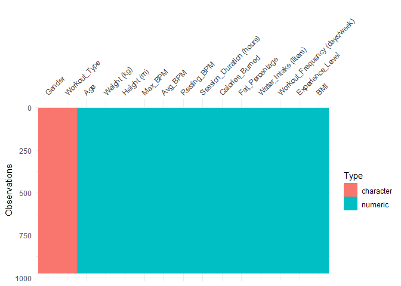<!-- -->

### Obróbka i przyjrzenie się danym o typie character

Zmienne **Gender** oraz **Workout_Type** mają typ character,
prawdopodobnie lepiej jest je zmienić na factor.

Zacznę od płci :

``` r
dane$Gender = as.factor(dane$Gender)
```

Dzięki tej zmianie możemy użyc funkcji summary do sprawdzenia, ile jest
osób poszególnej płci w naszym zestawie danych.

``` r
summary(dane$Gender)
```

    ## Female   Male 
    ##    462    511

Zwizualizuję to na wykresie słupkowym :

``` r
ggplot(dane, aes(x=Gender, fill = Gender)) +
  geom_bar()+
  labs(x="Płeć", y="Ilość", fill = "Płeć") +
  scale_x_discrete(labels = c("Female" = "Kobieta", "Male" = "Mężczyzna"))+
  scale_fill_manual(values = c("Female" = "orange", "Male" = "lightblue"),
                    labels = c("Female" = "Kobieta", "Male" = "Mężczyzna")) +
  theme_minimal()
```

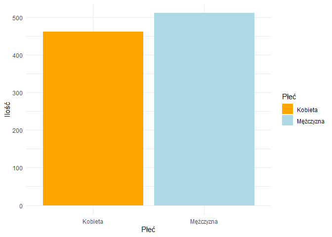<!-- -->

Przy okazji sprawdźmym jak to wygląda procentowo. Tworzę tablicę, która
pokazuje, ile mamy kobiet oraz mężczyzn.

``` r
table(dane$Gender)
```

    ## 
    ## Female   Male 
    ##    462    511

``` r
round((sum(dane$Gender == "Female")/973), 2)
```

    ## [1] 0.47

Kobiety stanowią w zaokrągleniu **47%** próbki.

Wracamy do obróbki…

To samo dotyczy się zmiennej **Workout_Type** - sprawdzam, ile jest
unikatowych typów treningów tym zestawie.

``` r
unique(dane$Workout_Type)
```

    ## [1] "Yoga"     "HIIT"     "Cardio"   "Strength"

Mamy rozróżnienie na **4 różne treningi** - myślę, że rozsądnym byłoby
tu również zmienić typ zmiennej na factor.

``` r
dane$Workout_Type = as.factor(dane$Workout_Type)
```

Ponownie używam funkcji `summary` do przyjrzenia się, ile jest danych
typów treningów w zestawie.

``` r
summary(dane$Workout_Type)
```

    ##   Cardio     HIIT Strength     Yoga 
    ##      255      221      258      239

Wizualizacja typów treningu na wykresie słupkowym:

``` r
ggplot(dane, aes(x=Workout_Type, fill = Workout_Type)) +
  geom_bar()+
  labs(x="Typ treningu", y="Ilość",fill = "") +
  theme_minimal()
```

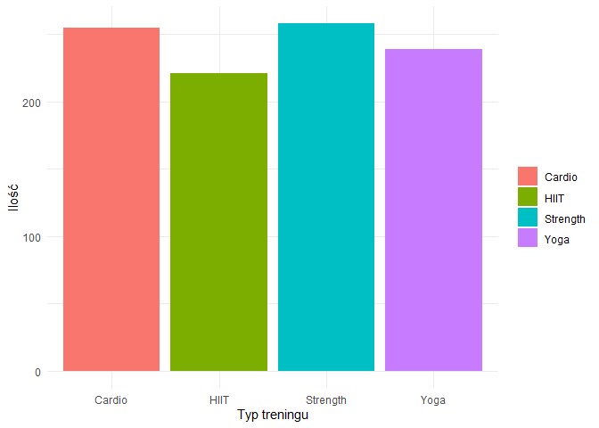<!-- -->

Pozostałe zmienne mają *typ numeryczny*.

### Sprawdzenie wartości brakujących.

``` r
md.pattern(dane, rotate.names = TRUE)
```

    ##  /\     /\
    ## {  `---'  }
    ## {  O   O  }
    ## ==>  V <==  No need for mice. This data set is completely observed.
    ##  \  \|/  /
    ##   `-----'

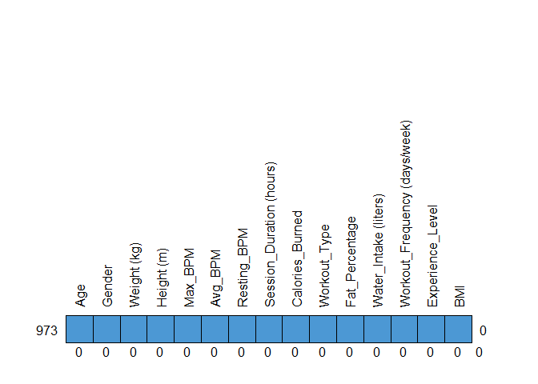<!-- -->

    ##     Age Gender Weight (kg) Height (m) Max_BPM Avg_BPM Resting_BPM
    ## 973   1      1           1          1       1       1           1
    ##       0      0           0          0       0       0           0
    ##     Session_Duration (hours) Calories_Burned Workout_Type Fat_Percentage
    ## 973                        1               1            1              1
    ##                            0               0            0              0
    ##     Water_Intake (liters) Workout_Frequency (days/week) Experience_Level BMI  
    ## 973                     1                             1                1   1 0
    ##                         0                             0                0   0 0

Zauważam również **brak wartośći NA**.

### Zmiana nazw kolumn

Zmieniam nazwy kolumn w celu ułatwienia ich wywoływania. (Usunięcie
spacji i nawiasów)

``` r
names(dane) <- c(
  "Age", "Gender", "Weight_kg", "Height_m", 
  "Max_BPM", "Avg_BPM", "Resting_BPM", "Session_Duration_hours", 
  "Calories_Burned", "Workout_Type", "Fat_Percentage", "Water_Intake_liters", 
  "Workout_Frequency_days_per_week", "Experience_Level", "BMI")
```

## Rozkład ludzi na siłowni

### 1. Rozkład wiekowy

Sprawdzę jak rozkłada się wiek użytkowników siłowni.

W tym celu narysuję histogram z krzywą gęstości.

``` r
ggplot(dane, aes(x = Age)) + 
  geom_histogram(aes(y = after_stat(density)),
                 colour = 1, fill = "white", bins = 12) +
  geom_density(lwd = 1, colour = 4,
               fill = 4, alpha = 0.25)+
  labs(x="Wiek", y= "Gęstość")
```

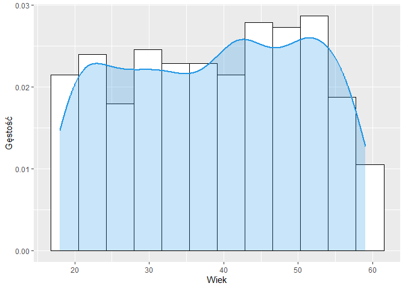<!-- -->

Zauważmy, że rozkład wieku jest mniej więcej równy.

Wyodrębnijmy podstawowe statystyki opsiowe dla wieku.

``` r
summary(dane$Age)
```

    ##    Min. 1st Qu.  Median    Mean 3rd Qu.    Max. 
    ##   18.00   28.00   40.00   38.68   49.00   59.00

Wnioski :

- Najmłodsza osoba w zbiorze ma **18 lat**, a najstarsza **59 lat**.

- **Mediana** wynosi **40 lat**, z tego wynika, że połowa osób w zbiorze
  ma równo lub mniej niż 40 lat, a druga połowa więcej lub równo.

- **Średnia** wynosi **38.68**, co sugeruje, że wiek jest rozkładem w
  miarę symetrycznym lub lekko przesuniętym w kierunku młodszych osób
  (średnia ma podobną wartość co mediana).

- **Pierwszy kwartyl (28 lat):** 25% osób w zbiorze ma **28 lat lub
  mniej**.

- **Trzeci kwartyl (49 lat):** 25% osób w zbiorze ma **49 lat lub
  więcej**.

- **IQR - Rozstęp między kwartylowy (Q3-Q1)**: Połowa osób znajduje się
  w przedziale wiekowym od **28 do 49 lat**.

### 2. Rozkład masowy

``` r
ggplot(dane, aes(x=Weight_kg)) +
  geom_histogram (aes(y = after_stat(density)), fill = "lightgreen",color="black", bins = 10)+
  geom_density(lwd = 1, colour = "black") +
  geom_vline(aes(xintercept = mean(dane$Weight_kg)), linetype = "dashed", color = "red", linewidth = 1) +
  labs(x= "Masa", y="Gęstość")+
  theme_minimal()
```

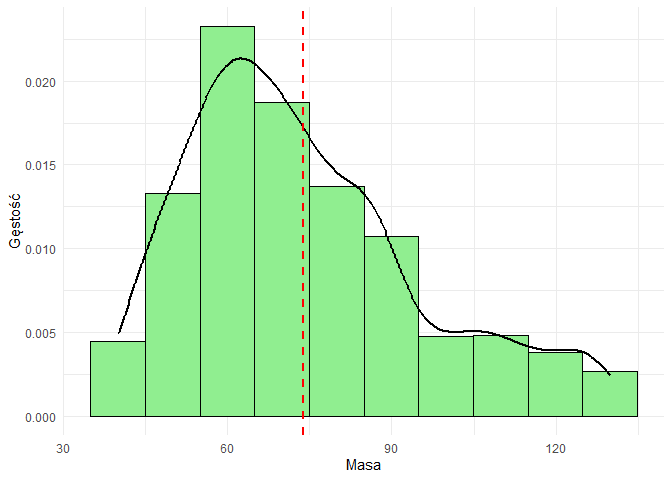<!-- -->

**Wnioski**: Największy odstetek osób na siłowni waży **od 55 do 65
kg.** Zauważam **skośność prawostronną** (łagodniejszy “zjazd” z prawej
strony wykresu), co oznacza, że mamy dużo obserwacji, które przyjmują
wartości mniejsze od średniej (73.85 kg).

### 3. Rozkład maksymalnego tętna

Przywołam podstawowe statystyki dla maksymalnego tętna.

``` r
summary(dane$Max_BPM)
```

    ##    Min. 1st Qu.  Median    Mean 3rd Qu.    Max. 
    ##   160.0   170.0   180.0   179.9   190.0   199.0

Zwizualizuję na histogramie z krzywą gęstości rozkład maksymalnego
tętna.

``` r
ggplot(dane, aes(x=Max_BPM)) +
  geom_histogram (aes(y = after_stat(density)), fill = "#FF474C",color="black", bins = 10)+
  geom_density(lwd = 1, colour ="darkgrey",
                alpha = 0.25) +
  labs(x= "Maksymalne tętno", y="Gęstość")+
  theme_minimal()
```

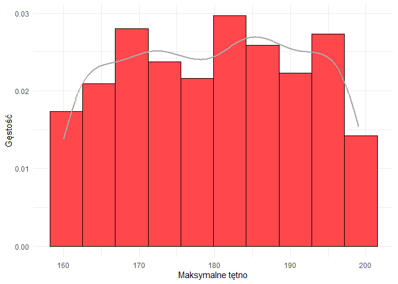<!-- -->

**Wnioski:** Największa liczba obserwacji (moda) występuje w
przedziałach zbliżonych do wartości około 180 uderzeń na minutę, co
sugeruje, że jest to najczęściej występująca wartość maksymalnego tętna
w tym zbiorze danych. Wartości tętna poniżej 160 oraz powyżej 200 nie
występują.

## Macierz korelacji

Wynik macierzy postaram się wykorzystać do sformułowania trafnych pytań
badawczych w dalszej części pracy.

``` r
cor <- cor(dane[, sapply(dane, is.numeric)])
corrplot(cor, method = "square", type = "upper", tl.cex = 0.4, tl.col = "black",
tl.srt = 90, addCoef.col = "black", number.cex = 0.6 )
```

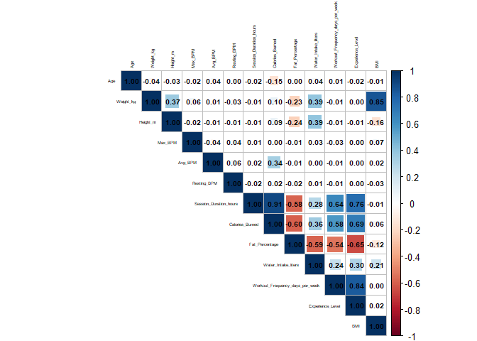<!-- -->

**Obserwacje**:

- Widzę *zdecydowaną dodatnią korelację* między **częstotliwością
  treningu** a **poziomem doświadczenia**. Zbadam to dokładniej w
  późniejszej analizie

- Istnieje *silna dodatnia korelacja* między **BMI** a **Wagą**, co jest
  zgodne z definicją BMI, które zależy od wagi i wzrostu.

- Zauważam, że procent tkanki tłuszczowej *ujemnie koreluje* ze
  spożyciem wody, oraz częstotliowością treningów.

- Nietypową i zaskakującą obserwacją jest brak wyraźnej zależności
  pomiędzy wskaźnikiem masy ciała **(BMI)** a poziomem tkanki
  tłuszczowej **(Fat_Percentage)**.

  Przyjrzę się temu na wykresie punktowym wraz z linią regresji :

  ``` r
  ggplot(dane, aes(x = BMI, y = Fat_Percentage)) +
    geom_point(color = "black") +
    geom_smooth(method = "lm", color = "yellow", se=FALSE) +
    labs(title = "Zależność między BMI a poziomem tkanki tłuszczowej",
         x = "BMI", y = "Tkanka tłuszczowa (%)")+
    theme_minimal()
  ```

  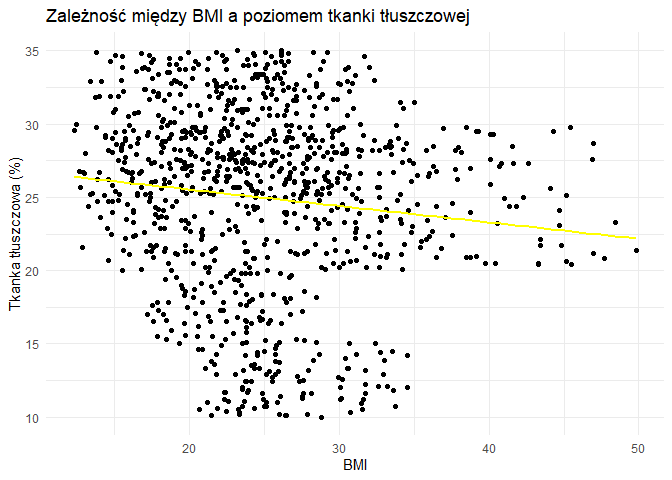<!-- -->

  Faktycznie - już na etapie wykresu punkotwego zauważam brak wyraźnej
  zależności, jednak dla pewności sprawdzę ile wynosi wskaźnik R^2 :

  ``` r
  BMIvsFAT <- lm(Fat_Percentage ~ BMI, data = dane)
  summary(BMIvsFAT)
  ```

      ## 
      ## Call:
      ## lm(formula = Fat_Percentage ~ BMI, data = dane)
      ## 
      ## Residuals:
      ##     Min      1Q  Median      3Q     Max 
      ## -15.265  -3.530   1.255   4.338  10.400 
      ## 
      ## Coefficients:
      ##             Estimate Std. Error t value Pr(>|t|)    
      ## (Intercept) 27.76867    0.77210  35.965  < 2e-16 ***
      ## BMI         -0.11207    0.02994  -3.743 0.000193 ***
      ## ---
      ## Signif. codes:  0 '***' 0.001 '**' 0.01 '*' 0.05 '.' 0.1 ' ' 1
      ## 
      ## Residual standard error: 6.218 on 971 degrees of freedom
      ## Multiple R-squared:  0.01422,    Adjusted R-squared:  0.01321 
      ## F-statistic: 14.01 on 1 and 971 DF,  p-value: 0.0001926

Zauważam, że wartość **R^2** jest równa prawie **0** to potwierdza
**całkowity brak zależności** liniowej między tymi zmiennymi.

## Pytania badawcze:

1.  Jaki trening kobiety preferują najbardziej?

2.  Jaki trening wybierają osoby z wysokim BMI?

3.  Ile razy w tygodniu ćwiczą ludzie na siłwoni z podziałem na płeć?

4.  Czy typ ćwiczeń wpływa na spalone na kalorie oraz spożycie wody
    podczas treningu?

5.  Czy osoby bardziej doświadczone częściej trenują na siłowni?

6.  Czy osoby wykonujące dłuższy trening spalają więcej kalorii na
    godzinę?

7.  Czy osoby o dużym poziomie doświadczenia mają mniejszy procent
    tkanki tłuszczowej?

8.  Czy wzrost wpływa na liczbę spalanych kalorii podczas treningu?

9.  Czy wiek wpływa na częstotliwość treningów?

10. Czy osoby starsze spalają mniej kalorii niż osoby młodsze?

### Jaki trening kobiety preferują najbardziej?

Zacznę od wizualizacji danych dotyczących preferencji treningowych z
podziałem na płeć. Wykorzystam do tego wykres słupkowy.

``` r
ggplot(dane, aes(x = Workout_Type, fill = Gender)) +
  geom_bar(position = "stack", show.legend = TRUE) +
  labs(title = "Popularność ćwiczeń według płci", x = "Rodzaj ćwiczeń", y = "Liczba klientów", fill = "Legenda") +
    scale_fill_manual(values = c("Female" = "pink", "Male" = "lightblue"),
                    labels = c("Female" = "Kobieta", "Male" = "Mężczyzna")) +
  theme_minimal()
```

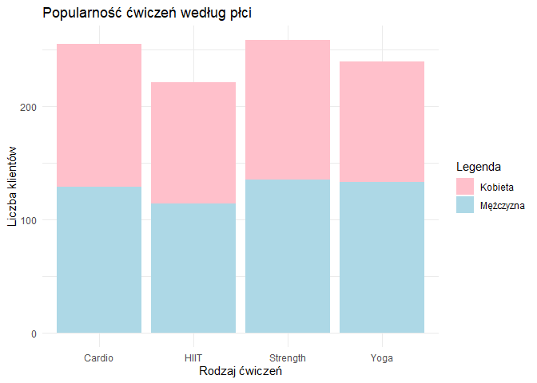<!-- -->

**Wnioski**: Na wykresie widać, że podział między kobietami a
mężczyznami jest dość wyrównany. Zarówno kobiety, jak i mężczyźni
wybierają podobne rodzaje ćwiczeń, bez wyraźnej przewagi którejś z płci.
Szczerze mówiąc, spodziewałem się, że kobiety częściej będą wybierać
treningi typu Cardio i Yogę, a rzadziej trening siłowy, natomiast
mężczyźni odwrotnie – że postawią głównie na siłownię. Jak się okazało,
myliłem się, ponieważ powyższy wykres słupkowy tego nie potwierdza.

### Jaki trening wybierają osoby z wysokim BMI?

Zacznijmy od narysowania wykresu ogólnego dla całego zbioru danych.

``` r
ggplot(dane, aes(x = Workout_Type, y = BMI, color = Workout_Type)) +
  geom_jitter() +
  labs(title = "Wpływ BMI na częstotliwość wykonywanego treningu", x = "Rodzaj ćwiczeń", y = "BMI", color = "")+
  theme_minimal()
```

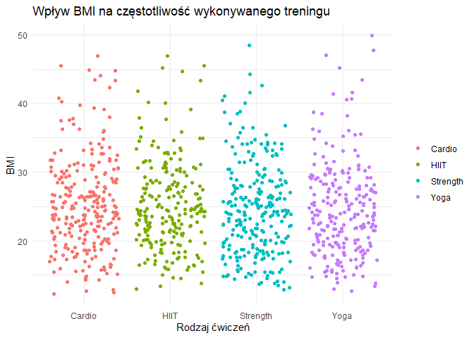<!-- -->

Niestety z tego wykresu niewiele możemy się dowiedzięć o wyborach osób z
wyższym BMI.

Przyjrzę się danym bliżej.

W związku z tym filtruję osoby z BMI większym niż 30.

``` r
wysokie_bmi <- dane %>%
  filter(BMI > 30)
```

Następnie tworzę wykres słupokwy z podziałem na rodzaj ćwiczeń :

``` r
ggplot(wysokie_bmi, aes(x = Workout_Type)) +
  geom_bar(aes(fill = Workout_Type), show.legend = FALSE) +
  labs(title = "Popularność ćwiczeń wśród osób z wysokim BMI (BMI > 30)", 
       x = "Rodzaj ćwiczeń", y = "Liczba osób", fill = "") +
  theme_minimal()
```

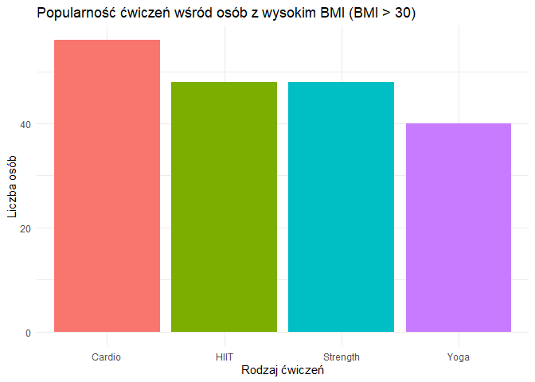<!-- -->

Tworzę również tabele dla dokładniejszej analizy

``` r
table(wysokie_bmi$Workout_Type)
```

    ## 
    ##   Cardio     HIIT Strength     Yoga 
    ##       56       48       48       40

**Wnioski:** Najpopularniejszym wyborem jest oczywiście trening
***Cardio***. Drugie miejsce zajmuję trening ***HIIT*** wraz z
treningiem siłowym (***Strength***). Na ostatnim miejscu bez zaskoczeń
znajduje się ***Yoga***. Spodziewałem się takich rezultatów - to dość
logiczne, że osoby z wyższym BMI przychodzą na siłownię w celu
schudnięcia, czyli wybiorą trening kardio.

Czym jest *trening HIIT*?

HIIT (z ang. High Intensity Interval Training) to trening interwałowy o
wysokiej intensywności. Ten rodzaj treningu był opracowany specjalnie
dla profesjonalnych sportowców i miał występować w postaci przygotowań
przed zawodami. Obecnie jest stosowany też przez amatorów, ze względu
szybszą redukcję tkanki tłuszczowej.

Definicja doskonale tłumaczy dlaczego HIIT uplasował się aż na drugim
miejscu.

### Ile razy w tygodniu ćwiczą ludzie na siłwoni z podziałem na płeć?

Zacznę od przyjrzenia się danym na wykresie słupkowym.

``` r
ggplot(dane, aes(x = Workout_Frequency_days_per_week , fill = Gender)) +
  geom_bar(position = "dodge") +
  labs(title = "Ile razy w tygodniu ćwiczą ludzie na siłowni z podziałem na płeć", 
       x = "Liczba dni treningów w tygodniu",y = "Liczba osób",fill = "Płeć") +
  scale_fill_manual(values = dane$Gender,
                    labels = c("Female" = "Kobieta", "Male" = "Mężczyzna"))+
  theme_classic()
```

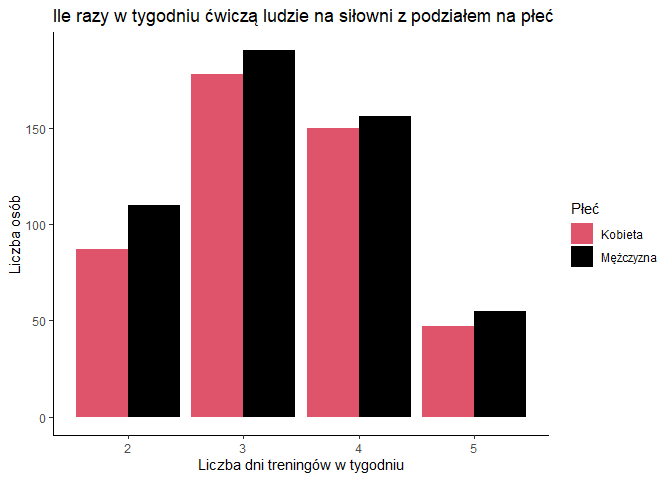<!-- -->

**Wnioski** : Widzimy podobne rezulaty dla kobiet oraz mężczyzn.

Najwięcej ludzi decyduje się na trening **3 razy w tygodniu,** drugim
najczęstszym wyborem są 4 treningi.

Zdecydowanie najmniej osób decyduje się na trening 5 razy w tygnodiu.

``` r
min(dane$Workout_Frequency_days_per_week)
```

    ## [1] 2

Zauważmy, że nikt z badanych nie chodzi mniej niż dwa razy w tygodniu.
Wpływ na to może mieć stosunkowo mała próbka (zaledwie 973 rekordy).

### Czy typ ćwiczeń wpływa na spalone na kalorie oraz spożycie wody podczas treningu?

#### Dla spalonych kalorii:

Sprawdzam podstawowe statystyki opisowe:

``` r
dane %>% group_by(Workout_Type) %>% summarise(
    Min = min(Calories_Burned),
    Q1 = quantile(Calories_Burned, 0.25),
    Mediana = median(Calories_Burned),
    Średnia = mean(Calories_Burned),
    Q3 = quantile(Calories_Burned, 0.75),
    Max = max(Calories_Burned))
```

    ## # A tibble: 4 × 7
    ##   Workout_Type   Min    Q1 Mediana Średnia    Q3   Max
    ##   <fct>        <dbl> <dbl>   <dbl>   <dbl> <dbl> <dbl>
    ## 1 Cardio         303  725     888     885. 1068.  1625
    ## 2 HIIT           333  739     920     926. 1095   1766
    ## 3 Strength       350  720.    904.    911. 1051   1783
    ## 4 Yoga           330  708     876     903. 1120.  1582

Sprawdzam dane na wykresie pudełkowym:

``` r
ggplot(dane, aes(x=Workout_Type, y = Calories_Burned, fill = Workout_Type)) +
   geom_boxplot() +
  labs(x = "Typ treningu",y = "Spalone kalorie", fill = "") +
  theme_minimal()  
```

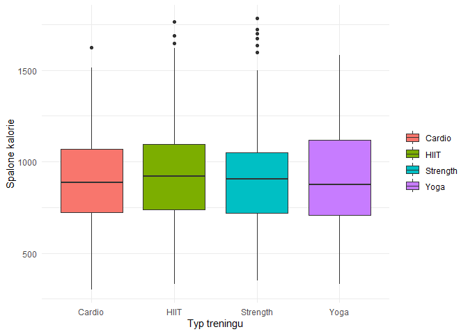<!-- -->

**Wnioski** : Rozkłady wyglądają mniej więcej równie, jednak pojawiają
się outliery. Najwięcej outlierów pojawia się przy treningu siłowym.
Żaden nie pojawił się przy Yodzę. Na wykresie zadziwiający jest dla mnie
rezultat dotyczący treningu kardio. Nie sądziłem, że będzie on na równo
z pozostałymi.

Natomiast analizując tabelę statystyk opisowych *HIIT wygrywa* pod
względem efektywności spalania kalorii (najwyższa średnia oraz mediana).
Z tego wynika, że jeżeli zależy nam na maksymalnym efekcie, warto
rozważyć HIIT.

#### Dla spożycia wody:

Sparawdzamy podstawowe statystyki opisowe:

``` r
dane %>% group_by(Workout_Type) %>% summarise(
    Min_= min(Water_Intake_liters),
    Q1 = quantile(Water_Intake_liters, 0.25),
    Mediana = median(Water_Intake_liters),
    Średnia = mean(Water_Intake_liters),
    Q3 = quantile(Water_Intake_liters, 0.75),
    Max = max(Water_Intake_liters))
```

    ## # A tibble: 4 × 7
    ##   Workout_Type  Min_    Q1 Mediana Średnia    Q3   Max
    ##   <fct>        <dbl> <dbl>   <dbl>   <dbl> <dbl> <dbl>
    ## 1 Cardio         1.5   2.2     2.6    2.62   3.1   3.7
    ## 2 HIIT           1.5   2.1     2.6    2.65   3.3   3.7
    ## 3 Strength       1.5   2.1     2.6    2.60   3     3.7
    ## 4 Yoga           1.5   2.2     2.7    2.64   3.1   3.7

Sprawdzam dane na wykresie pudełkowym :

``` r
ggplot(dane, aes(x=Workout_Type, y = Water_Intake_liters, fill = Workout_Type)) +
   geom_boxplot() +
  labs(x = "Typ trenigu", y = "Spożycie wody") +
  theme_minimal() 
```

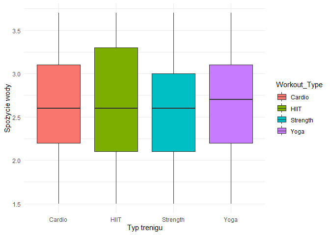<!-- -->

**Wnioski :** Na podstawie tych danych widać, że typ ćwiczeń raczej nie
wpływa mocno na to, ile wody pijemy podczas treningu, bo średnia dla
wszystkich rodzajów ćwiczeń jest praktycznie taka sama – około 2.6
litra.

Na wykresie pudełkowym zauważalne jest jednak, że przy HIIT spożycie
wody najbardziej się różni między osobami (stosunkowo wysoka wartość
IQR), co może oznaczać, że przy tym typie treningu trzeba bardziej
indywidualnie podchodzić do nawodnienia – jedni potrzebują więcej, inni
mniej.

### Czy osoby bardziej doświadczone częściej trenują na siłowni?

Zacznę od stworzenia tabeli, która pokazuje ile jest osób o danym
poziomem doświadczenia.

``` r
table(dane$Experience_Level) 
```

    ## 
    ##   1   2   3 
    ## 376 406 191

Średnia liczba sesji w tygodniu pod względem doświadczenia.

``` r
(podsumowanie <- dane %>%
  group_by(Experience_Level) %>%
  summarise(ŚredniaLiczbaSesji = mean(Workout_Frequency_days_per_week)))
```

    ## # A tibble: 3 × 2
    ##   Experience_Level ŚredniaLiczbaSesji
    ##              <dbl>              <dbl>
    ## 1                1               2.48
    ## 2                2               3.53
    ## 3                3               4.53

Zauważam tendencję wzrostową - wraz z poziomem doświadczenia rośnie
średnia liczba sesji tygodniowych.

Wizualizacja na wykresie.

``` r
ggplot(podsumowanie, aes(x = as.factor(Experience_Level), y = ŚredniaLiczbaSesji, fill = as.factor(Experience_Level))) +
  geom_bar(stat = "identity") +
  labs(
    title = "Średnia liczba sesji tygodniowo dla poziomów doświadczenia",
    x = "Poziom doświadczenia",
    y = "Średnia liczba sesji tygodniowo",
    fill ="Poziom doświadczenia"
  ) +
  theme_minimal()
```

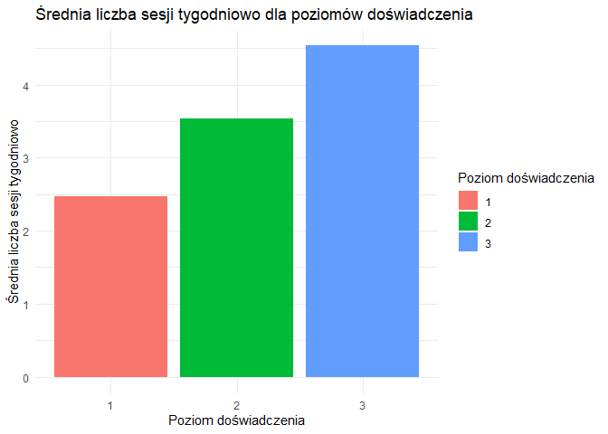<!-- -->

**Wnioski:** Średnia liczba sesji ćwiczeniowych wzrasta wprost
proporcjonalnie z poziomem doświadczenia. Większa liczba sesji
tygodniowo u bardziej doświadczonych osób może wynikać z lepszego
planowania treningów, większej regeneracji organizmu lub po prostu z
pasji.

### Czy osoby wykonujące dłuższy trening spalają więcej kalorii na godzinę?

``` r
ggplot(dane, aes(x = Session_Duration_hours, y = Calories_Burned)) +
  geom_point( color = "blue") +
  geom_smooth(method = "lm", se = FALSE, color = "red") +
  labs(
    title = "Związek między czasem trwania sesji a spalonymi kaloriami",
    x = "Czas trwania sesji (h)",
    y = "Spalone kalorie"
  ) +
  theme_minimal()
```

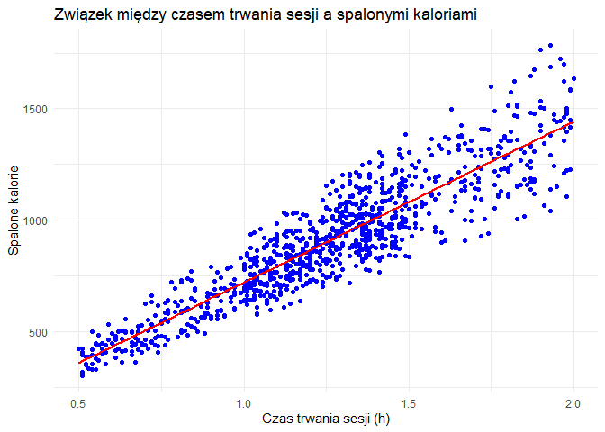<!-- -->

Na wykresie wyraźnie widać, że czas trawania ma bardzo znaczący wpływ na
spalanie kalorii. Jak dokładny? Sprawdzę to licząc poziom zależności
między tymi zmiennymi.

Policzenie współczynnika **korelacji liniowej Pearsona**

``` r
correlation <- cor(dane$Session_Duration_hours, dane$Calories_Burned, method = "pearson")
round(correlation, 2)
```

    ## [1] 0.91

**Wnioski:** Widzimy bardzo wysoką wartość **0.91**, co oznacza *silną
dodatnią korelację* liniową między czasem trwania sesji a liczbą
spalonych kalorii na godzinę. Z tego wynika, że wraz ze wzrostem czasu
trwania sesji rośnie liczba spalonych kalorii na godzinę - co zdaje sie
być całkiem logiczne.

### Czy osoby o dużym poziomie doświadczenia mają mniejszy procent tkanki tłuszczowej?

Zacznę od przedstawienia danych na *wykresach pudełkowych*.

``` r
ggplot(dane, aes(x = as.factor(Experience_Level), y = Fat_Percentage)) +
  geom_boxplot( fill = "lightblue", color = "black") +
  labs(title = "Poziom doświadczenia a procent tkanki tłuszczowej",
       x = "Poziom doświadczenia",
       y = "Procent tkanki tłuszczowej") +
  theme_minimal()
```

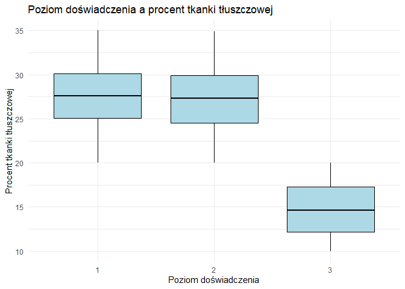<!-- -->

**Wnioski:** Zauważamy, że poziom doświadczenia wpływa na zmniejszenie
procentu tkanki tłuszczowej. Jednak efekt ten jest zauważalny dopiero
przy najwyższym poziomie doświadczenia.

Sprawdzę jeszcze *wykresy skrzypcowe*, żeby sprawdzić zagęszczenie tej
cechy.

``` r
ggplot(dane, aes(x = as.factor(Experience_Level), y = Fat_Percentage)) +
  geom_violin(trim = FALSE, fill = "lightgreen", color = "black")  +
  labs(title = "Poziom doświadczenia a procent tkanki tłuszczowej",
       x = "Poziom doświadczenia",
       y = "Procent tkanki tłuszczowej") +
  theme_minimal()
```

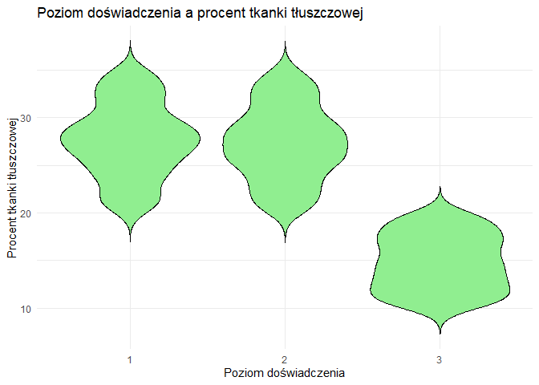<!-- -->

**Wnioski:** Widać wyraźnie, że przy najwyższym poziomie doświadczenia
zagęszczenie cechy występuję niżej niż u pozostałych. To potwierdza
nasze poprzednie wnioski. Dodatkowo w przypadku najwyższej rangi
doświadczenia wykres skrzypcowy pokazuje delikatne wydłużenie w kierunku
niższych wartości.

### Czy wzrost wpływa na liczbę spalanych kalorii podczas treningu?

Zacznę od narysowania wykresu punktowego z linią regresji.

``` r
ggplot(dane, aes(x = Height_m, y = Calories_Burned)) +
  geom_point(color="darkgrey") +
  geom_smooth(method = "lm", color = "orange", se=FALSE) +
  labs(title = "Zależność między wzrostem a liczbą spalanych kalorii",
       x = "Wzrost (m)",
       y = "Spalone kalorie") +
  theme_minimal()
```

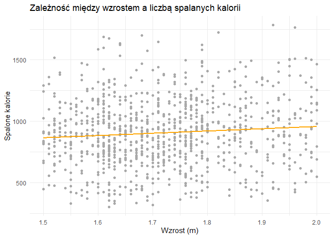<!-- -->

Wykres wraz z linią regresji nie wskazuje na jakąś znaczącą zależność,
między tymi zmiennymi. Punkty są bardzo “porozrzucane”.

Dla pewności zbadam współczynnik korelacji liniowej Pearsona i sprawdzę
ile wynosi jego wartość.

``` r
round(cor(dane$Height_m, dane$Calories_Burned, method = "pearson"),2)
```

    ## [1] 0.09

**Wnioski:** Współczynnik korelacji liniowej Pearsona wynosi w
zaokrągleniu **0.09**. Wskazuje to na praktyczny **brak zależności
między wzrostem osoby a liczbą spalonych kalorii podczas treningu.**
Drobnym zdziwieniem dla mnie jest wynik badania - wzrost nie jest
istotnym czynnikiem wpływającym na liczbę spalanych kalorii. Nie
spodziewałem się rezultatów bliskim 1, jednak liczyłem na współczynnik o
wartości co najmniej 0.50.

### Czy wiek wpływa na częstotliwość treningów?

``` r
ggplot(dane, aes(x=Age, y= as.factor(Workout_Frequency_days_per_week), color = Workout_Frequency_days_per_week)) +
  geom_jitter() +
  labs(x="Wiek", y= "Częstotliwość treningu", color = "Częstotliwość treningu")+
  theme_minimal()
```

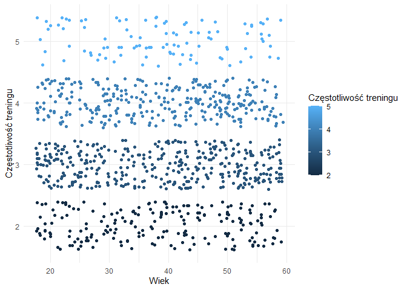<!-- -->

Wykres punktowy wskazuję na brak zależności. Zobaczę co pokazuje
współczynnik korelacji.

``` r
cor(dane$Age, dane$Workout_Frequency_days_per_week)
```

    ## [1] 0.008055163

Współczynnik korelacji ~ 0

**Wnioski:** Współczynnik korelacji w przybliżeniu wynosi 0. Ku mojemu
zaskoczeniu zauważamy całkowity brak zależności między wiekiem a
częstotliwością treningów. Osoby starsze są tak same zaangażowane jak
młodsze. Wykres pokazuje również, że każda grupa wiekowa ma te same
preferencje dotyczące liczby treningów w tygodniu.

### Czy osoby starsze spalają mniej kalorii niż osoby młodsze?

Rozpoczynam od podziału wieku na grupy i wizualizacji danych na wykresie
krzywej gęstości.

``` r
podzialWieku <- ifelse(dane$Age < 40, "Młodsi", "Starsi")

ggplot(dane, aes(x = Calories_Burned, fill = podzialWieku)) +
  geom_density(alpha = 0.6) +
  labs(title = "Krzywe gęstości spalania kalorii dla poszczególnych grup wiekowych",x = "Spalone kalorie", y = "Gęstość", fill = "Grupa wiekowa") +
  theme_minimal()
```

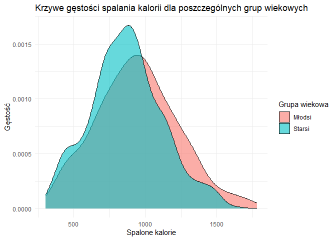<!-- -->

Policzenie średnich :

``` r
tapply(dane$Calories_Burned, podzialWieku, mean)
```

    ##   Młodsi   Starsi 
    ## 943.5052 867.5738

Dokonałem podziału na młodszych i strarszych (\>40). Wybrałem 40 lat,
ponieważ dokładnie tyle wynosi mediana wieku w całym zbiorze.

**Wnioski:** Na przedstawionym powyżej wykresie krzywej gęstości dla obu
grup wiekowych oraz użytej funkcji `tapply` jestem w stanie stwierdzić,
że ludzie młodsi średnio spalają więcej kalorii niż osoby starsze.
Rozkład dla młodszych jest mniej skoncentrowany i rozkłada się na więcej
wartości. Dodatkowo widzimy, że te skrajne wartości prawostronne należą
w większości do młodszej grupy wiekowej. Sugeruje to nam, że ludzie w
wieku większym niż 40 lat raczej nie prefereują treningów ekstremalnych.
Zdecydowanie bardziej wolą oni zrównoważony trening.

## Podsumowanie

Wykonana przeze mnie analiza danych członków siłowni pozwala na
uzyskanie kilku znaczących wniosków w temacie użytkowników, ich
preferencji treningowych oraz korelacji.

Przywołam teraz te najistonijesze:

- Demografia:

  - Najliczniejszą grupę na siłowni stanowią osoby w wieku 25-34 lata.

  - Największy odstetek osób na siłowni waży od 55 do 65 kg.

  - Kobiety stanowią 47% próbki, co sugeruje o równym zainsteresowaniem
    dla obu płci.

- Preferencje

  - Podział między kobietami a mężczyznami jest dość wyrównany, jeżeli
    chodzi o wybór typu treningu.

  - Najpopularniejszym wyborem osób z wysokim BMI (\>30) jest trening
    kardio.

  - Najwięcej ludzi decyduje się na trening 3 razy w tygodniu.

  - Wybór treningu *HIIT* wygrywa pod względem efektywności spalania
    kalorii.

- Analizy

  - Średnia liczba sesji ćwiczeniowych wzrasta wprost proporcjonalnie z
    poziomem doświadczenia.

  - Wraz ze wzrostem czasu trwania sesji rośnie liczba spalonych kalorii
    na godzinę.

  - Poziom doświadczenia koreluje ujemenie z % tkanki tłuszczowej.
    Wzrost doświadczenia oznacza spadek % tkanki tłuszczowej.

  - Ludzie młodsi średnio spalają więcej kalorii niż osoby starsze.
